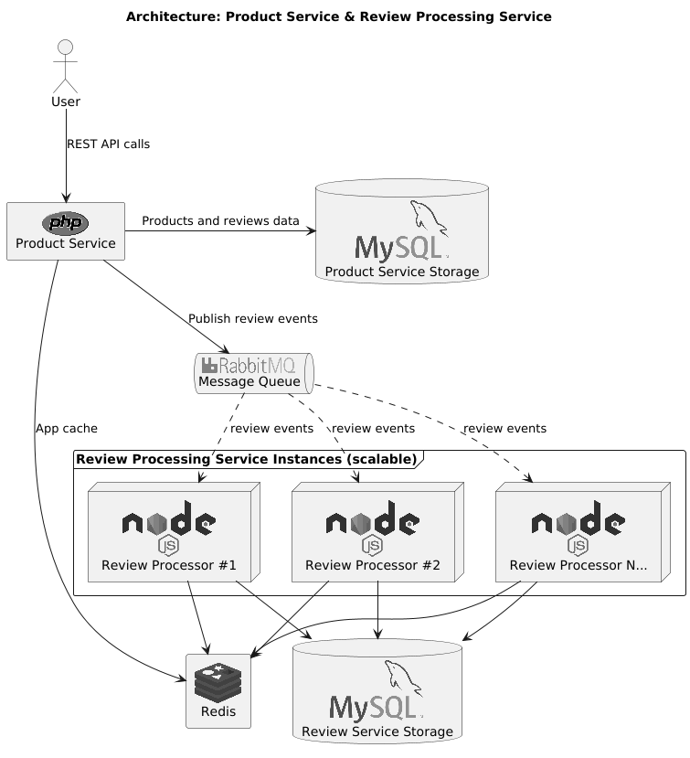

## Assignment Description

Your task is to build a two service system for product reviews.

Product service will expose RESTful API interfaces for manipulation with products and reviews.

Review processing service will handle calculation of average review product rating.

You are free to use any frameworks, databases, caching mechanisms and messaging brokers to develop a solution. However, taking into account the position, use PHP in combination with node.js.

---

## Service 1: Product service

- **RESTful API for products** with create, delete, edit, list and get by identifier actions
    - product information should **not return reviews**, only average product rating
- **RESTful API for reviews** with create, delete and edit actions
- **Endpoints to show product reviews**
- **Service should notify review service** when new review is added, modified or deleted

---

## Service 2: Review processing service

- Service receives events from product service
- Each time review is received, it calculates average rating and stores it into persistent storage
- Running in **2 separate instances**
    - design must be able to handle more than 2 instances
- Service must be able to **process multiple events concurrently**

**Note:** Product reviews and average product ratings should be cached.

---

## Product structure

- name
- description
- price
- list of reviews
- average rating (does not have to be directly a part of product)

---

## Review structure

- first name
- last name
- review text
- rating (1 - 5)

---

## Architecture diagram



(source file: [diagram.puml](./diagram.puml))

## Production deployment

- To run in production mode, use
  ```bash 
  docker-compose -f docker-compose.prod.yml up -d
  ```
- Execute migrations in product service container
  ```bash
  docker-compose -f docker-compose.prod.yml exec php bin/console doctrine:migrations:migrate --no-interaction
  ```
- Execute migrations in review processing service container
  ```bash
  docker-compose -f docker-compose.prod.yml exec nodejs npm run migration:run -- -d ./data-source.ts
  ```

## Usage

You can use [product.http](product.http) and [reviews.http](reviews.http) files to test the services.

